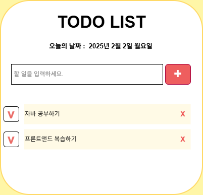

# My Daily To-Do 📝

> 작성일 : 2026-02-12
>
> 작성자 : 원하현

---
HTML, CSS, JavaScript 기초 학습을 마무리하며 제작한 간단한 투두리스트 프로젝트입니다.  
작은 규모의 프로젝트를 직접 기획 → 구현 → 완성하는 경험을 통해 프론트엔드 기술을 실습으로 연결했습니다.

---

## 🚀 주요 기능
- 할 일 추가 / 삭제
- 완료 / 미완료 토글 (체크박스)
- 할 일 수정 (인라인 편집)
- 오늘 날짜 표시
- 새로고침 시 데이터 유지 (LocalStorage)

---

## 🖼️ 화면 구성
- 제목 영역: "My Daily To-Do"
- 날짜 영역: 오늘 날짜 표시
- 입력 영역: 입력창 + 추가 버튼
- 목록 영역: 체크박스, 텍스트, 수정, 삭제 버튼

와이어프레임 예시:



---

## 🛠️ 기술 스택
- **HTML5**
- **CSS3**
- **JavaScript (ES6+)**
- 추가 라이브러리 없음 (Vanilla JS)

---

## 📂 폴더 구조
```
My Daily To-Do List//
|---todo-list.html
|---css/
|    |
|    | ---todo-list.css
|--- js/
|    |
|    |---todo-list.js
|--- docs/
|     |--- Project-Plan.md
|     |--- 와이어프레임.drawio
|
|--- .gitignore
|
|--- README.md
```


---

## 📅 일정 계획
- **1주차**: 기획서 완성 + 와이어프레임 + HTML/CSS 기본 구조
- **2주차**: 스타일링 + 반응형 + JavaScript 핵심 기능 구현
- **3주차**: 버그 수정 + 배포 + README 작성

---